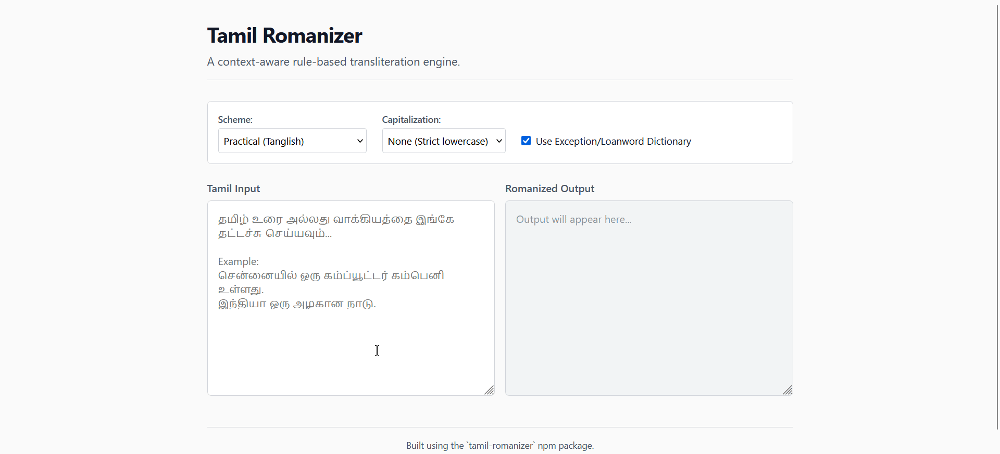

# tamil-romanizer

A completely context-aware, highly accurate Tamil-to-English romanization library for Node.js and the browser.

Unlike naive character-replacement scripts that turn `"சிங்கம்"` into `cinkam`, `tamil-romanizer` understands Tamil phonology. It natively handles intervocalic softening, post-nasal voicing, and word-boundaries to produce natural, readable Tanglish (e.g., `"singam"`). 

It is fast, rigorously tested (100% ISO compliance), and built for real-world text.

---

## Live Demo

Try the engine instantly in your browser: [**Tamil Romanizer Live Demo**](https://haroldalan.github.io/tamil-romanizer/)



---

## Why this library?

Most Tamil transliteration tools fail because they treat the language as a 1-to-1 character map. Tamil doesn't work that way. `tamil-romanizer` analyzes the context of every letter:

| Tamil Input | Naive approach | `tamil-romanizer` | Why? |
|-------------|----------------|-------------------|------|
| **ப**ம்பரம் | **p**am**p**aram | **p**am**b**aram | Identifies word-initial `p` vs post-nasal `b` |
| ச**ட்ட**ம் | sa**t**am | sa**tt**am | Detects geminate (double) consonant clusters |
| **ஞா**னம் | **ny**anam | **gn**anam | Uses practical Tanglish conventions for word-initials |
| **ஃ**பேன் | **ak**paen | **f**an | Analyzes Aytham lookaheads and cross-references an internal proper-noun dictionary |

---

## Installation

```bash
npm install tamil-romanizer
```

---

## Quick Start
```javascript
import { romanize } from 'tamil-romanizer';

// 1. Basic usage maps to highly accurate practical phonetics
const text = romanize("தமிழ்நாடு");
console.log(text); // "tamilnadu" (detected via built-in dictionary)

const text2 = romanize("பம்பரம்");
console.log(text2); // "pambaram" (context-aware mapping)
```

## Advanced Options

Provide an `options` object as the second argument to control the output format, scheme, or dictionary usage.

### 1. Capitalization Formatting

Romanize targets English letters (which have case), while Tamil does not. You can enforce casing rules natively:

```javascript
const sentence = "சென்னை ஒரு அழகான நகரம்";

console.log(romanize(sentence)); 
// "chennai oru azhagana nagaram" (Default: 'none' - strict lowercase)

console.log(romanize(sentence, { capitalize: 'sentence' })); 
// "Chennai oru azhagana nagaram"

console.log(romanize(sentence, { capitalize: 'words' })); 
// "Chennai Oru Azhagana Nagaram"
```

### 2. Scholarly Translating (ISO 15919)

If you are building an academic tool or require strict, lossless character-level transliteration, use the `iso15919` scheme.

```javascript
// ISO 15919 enforces direct diacritic mapping without contextual softening
const text = romanize("பம்பரம்", { scheme: 'iso15919', exceptions: false });
console.log(text); // "pamparam"

const strict = romanize("தமிழ்", { scheme: 'iso15919' });
console.log(strict); // "tamiḻ"
```
*(Also supports `ala-lc` schema via `{ scheme: 'ala-lc' }`)*

### 3. Turning off the Exception Dictionary

The library ships with a fast exception trie that automatically corrects common loan words and proper nouns (e.g. `பஸ்` -> `bus`, `சென்னை` -> `Chennai`). 

If you want the raw, algorithmic output of the underlying state machine, disable the `exceptions` flag:

```javascript
// With dictionary (Default)
romanize("பஸ்"); // "bus"

// Algorithmic output
romanize("பஸ்", { exceptions: false }); // "bas"
```

## Mixed-language Safe

Don't worry about sanitizing your inputs. If you pass a string containing English, numbers, emojis, or punctuation, `tamil-romanizer` surgically transliterates *only* the Tamil characters and leaves everything else perfectly intact.

```javascript
const mixed = "The ticket price is ௫௦௦ rupees (ரூபாய்) 🤯!";
console.log(romanize(mixed)); 
// "The ticket price is 500 rupees (roobaay) 🤯!"
```
*(Notice how it also safely converts native Tamil numerals natively!)*

## API Reference

`romanize(text: string, options?: Object) => string`

| Option | Type | Default | Description |
|---|---|---|---|
| `scheme` | `'practical' \| 'iso15919' \| 'ala-lc'` | `'practical'` | Determines the transliteration ruleset. |
| `exceptions` | `boolean` | `true` | Enables/disables the internal dictionary for loan words. |
| `capitalize` | `'none' \| 'sentence' \| 'words'` | `'none'` | Controls the casing of the returned string. |

---
*Built for Tamil by Harold Alan.*
